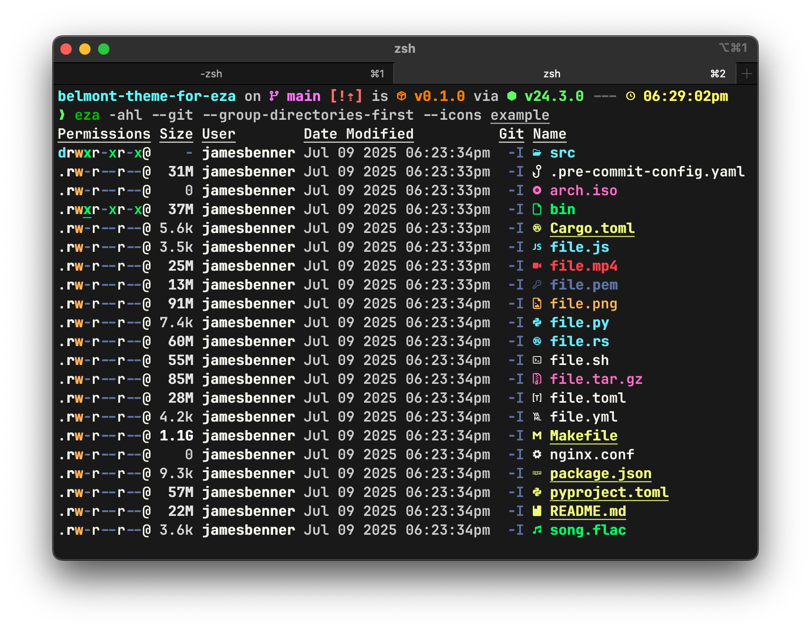

belmont-theme-for-eza
=====================

An [eza](https://eza.rocks/) theme inspired by [Dracula](https://github.com/eza-community/eza-themes/)
by [Preston Thorpe](https://github.com/PThorpe92).



Install
-------

### Linux

If you have `git` installed you can run the following command to install the theme:

```shell
bash -c "$(curl -LSfs https://raw.githubusercontent.com/jbenner-radham/belmont-theme-for-eza/refs/heads/main/install.sh)"
```

> [!NOTE]
> Using `bash` in the above command should be fine for most users. But, if
> needed you can change it to the shell of your choice. Please note however,
> that the install script requires a POSIX compatible shell.

<details>

<summary>Additional install methods.</summary>

Alternatively, if you would like to inspect the install script before running
it you can perform the following:

```shell
test -f "install.sh" && \
  printf "%s%s%s%s%s\n\n" \
    "$(tput bold)" \
    "An \"install.sh\" file is already present in this directory. The" \
    " file being downloaded will now be named either \"install.sh.1\"" \
    " or some variant thereof." \
    "$(tput sgr0)"
curl -LO --no-clobber https://raw.githubusercontent.com/jbenner-radham/belmont-theme-for-eza/refs/heads/install-script-test/install.sh
```

Then inspect the downloaded `install.sh` file and resume with the following
(assuming your file is `install.sh` and not `install.sh.1` or some variant
thereof):

```shell
chmod u+x install.sh
./install.sh
```

If you prefer to install your theme manually, `eza` will look for a theme using
the steps below in the following order:

1. If `$EZA_CONFIG_DIR` is set then `$EZA_CONFIG_DIR/theme.yml` will be loaded
   if it exists.
2. If `$EZA_CONFIG_DIR` is set then `$EZA_CONFIG_DIR/theme.yaml` will be loaded
   if it exists.
3. If `$XDG_CONFIG_HOME` is set then `$XDG_CONFIG_HOME/eza/theme.yml` will be
   loaded if it exists.
4. If `$XDG_CONFIG_HOME` is set then `$XDG_CONFIG_HOME/eza/theme.yaml` will be
   loaded if it exists.
5. If `$HOME/.config/eza/theme.yml` exists then it will be loaded.
6. If `$HOME/.config/eza/theme.yaml` exists then it will be loaded.

Choose your destination from the above and then copy or symlink `theme.yml` into
the desired location.

</details>

### macOS

If you have `git` installed you can run the following command to install the theme:

```shell
zsh -c "$(curl -LSfs https://raw.githubusercontent.com/jbenner-radham/belmont-theme-for-eza/refs/heads/main/install.sh)"
```

> [!NOTE]
> Using `zsh` in the above command should be fine for most users. But, if needed
> you can change it to the shell of your choice. Please note however, that the
> install script requires a POSIX compatible shell.

<details>

<summary>Additional install methods.</summary>

Alternatively, if you would like to inspect the install script before running it
you can perform the following:

```shell
test -f "install.sh" && \
  printf "%s%s%s%s%s\n\n" \
    "$(tput bold)" \
    "An \"install.sh\" file is already present in this directory. The" \
    " file being downloaded will now be named either \"install.sh.1\"" \
    " or some variant thereof." \
    "$(tput sgr0)"
curl -LO --no-clobber https://raw.githubusercontent.com/jbenner-radham/belmont-theme-for-eza/refs/heads/install-script-test/install.sh
```

Then inspect the downloaded `install.sh` file and resume with the following
(assuming your file is `install.sh` and not `install.sh.1` or some variant
thereof):

```shell
chmod u+x install.sh
./install.sh
```

If you prefer to install your theme manually, `eza` will look for a theme using
the steps below in the following order:

1. If `$EZA_CONFIG_DIR` is set then `$EZA_CONFIG_DIR/theme.yml` will be loaded
   if it exists.
2. If `$EZA_CONFIG_DIR` is set then `$EZA_CONFIG_DIR/theme.yaml` will be loaded
   if it exists.
3. If `$HOME/Library/Application Support/eza/theme.yml` exists then it will be
   loaded.
4. If `$HOME/Library/Application Support/eza/theme.yaml` exists then it will be
   loaded.

Choose your destination from the above and then copy or symlink `theme.yml` into
the desired location.

</details>

### Windows

> [!CAUTION]
> I haven't been able to verify the Windows install steps. This information has
> been gleaned from reading `eza`'s documentation and source code. If someone
> would care to confirm or deny the validity of these steps via an issue it
> would be much appreciated.

`eza` will look for a theme using the steps below in the following order:

1. If `%EZA_CONFIG_DIR%` is set then `%EZA_CONFIG_DIR%\theme.yml` will be loaded
   if it exists.
2. If `%EZA_CONFIG_DIR%` is set then `%EZA_CONFIG_DIR%\theme.yaml` will be
   loaded if it exists.
3. If `%AppData%\eza\theme.yml` exists then it will be loaded.
4. If `%AppData%\eza\theme.yaml` exists then it will be loaded.

Choose your destination from the above and then copy or symlink `theme.yml` into
the desired location.

Upgrade
-------

### Linux & macOS

If you installed **Belmont** via one of the `install.sh` script methods, you can
upgrade via the following:

```shell
cd "${XDG_DATA_HOME:-$HOME/.local/share}/belmont-theme-for-eza"
git pull
```

Troubleshooting
---------------

### "Some of my icons are not displaying properly. Why is that?"

Some icons used by **Belmont** are somewhat new to [Nerd Fonts](https://www.nerdfonts.com/).
The YAML file type icon immediately jumps to mind.

Just try redownloading and installing your desired font(s) to ensure you have
the latest version available.

If you're on Linux run `fc-cache -fv` to rebuild your font cache as well. You
may have to reboot after this for changes to fully take affect.

### "Why don't my theme colors match what's in the example screenshot?"

There are multiple environment variables that if set can override YAML based
themes. If you're on Linux or macOS try running the `install.sh` script. It will
check for common problems and notify you if it finds any. Including if any of
the problematic environment variables are set.
