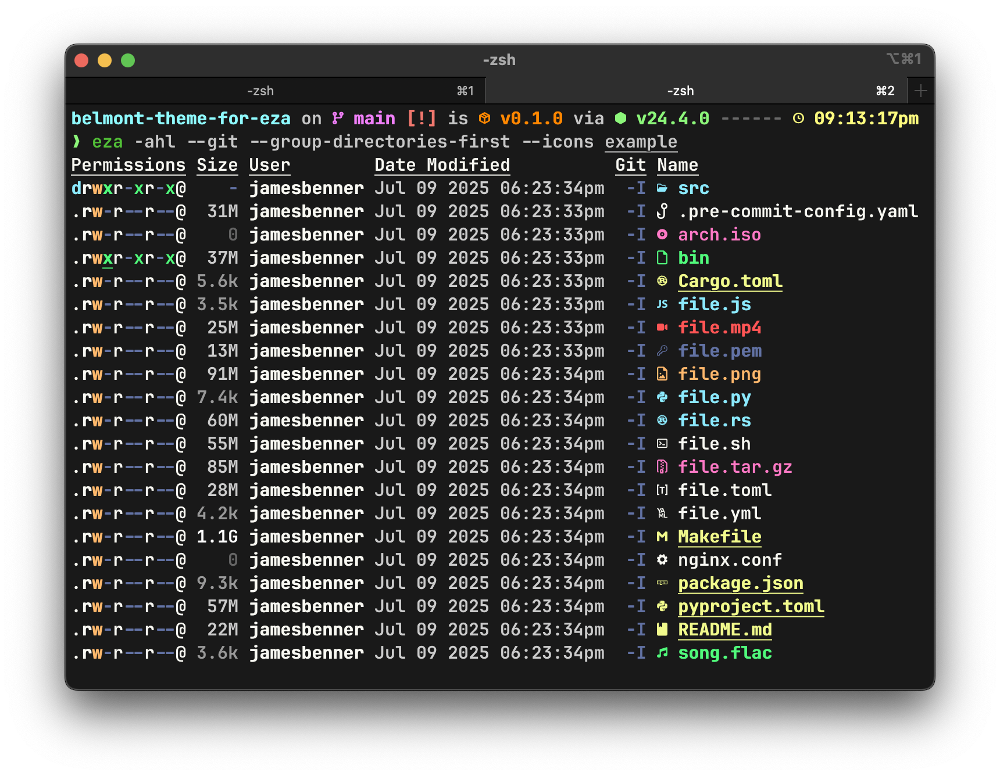

belmont-theme-for-eza
=====================

An [eza](https://eza.rocks/) theme inspired by [Dracula](https://github.com/eza-community/eza-themes/).



Install
-------

### Linux

If you have `git` installed you can run the following script to install the theme:

```shell
./install.sh
```

If you prefer to install your theme manually, `eza` will look for a theme using the steps below in the following order:

1. If `$EZA_CONFIG_DIR` is set then `$EZA_CONFIG_DIR/theme.yml` will be loaded if it exists.
2. If `$EZA_CONFIG_DIR` is set then `$EZA_CONFIG_DIR/theme.yaml` will be loaded if it exists.
3. If `$XDG_CONFIG_HOME` is set then `$XDG_CONFIG_HOME/eza/theme.yml` will be loaded if it exists.
4. If `$XDG_CONFIG_HOME` is set then `$XDG_CONFIG_HOME/eza/theme.yaml` will be loaded if it exists.
5. If `$HOME/.config/eza/theme.yml` exists then it will be loaded.
6. If `$HOME/.config/eza/theme.yaml` exists then it will be loaded.

Then copy or symlink `theme.yml` into the desired location.

### macOS

If you have `git` installed you can run the following script to install the theme:

```shell
./install.sh
```

If you prefer to install your theme manually, `eza` will look for a theme using the steps below in the following order:

1. If `$EZA_CONFIG_DIR` is set then `$EZA_CONFIG_DIR/theme.yml` will be loaded if it exists.
2. If `$EZA_CONFIG_DIR` is set then `$EZA_CONFIG_DIR/theme.yaml` will be loaded if it exists.
3. If `$HOME/Library/Application Support/eza/theme.yml` exists then it will be loaded.
4. If `$HOME/Library/Application Support/eza/theme.yaml` exists then it will be loaded.

Then copy or symlink `theme.yml` into the desired location.

### Windows

> [!CAUTION]
> I haven't been able to verify the Windows install steps. This information has been gleaned
> from reading `eza`'s documentation and source code. If someone would care to confirm or deny
> the validity of these steps via an issue it would be much appreciated.

`eza` will look for a theme using the steps below in the following order:

1. If `%EZA_CONFIG_DIR%` is set then `%EZA_CONFIG_DIR%\theme.yml` will be loaded if it exists.
2. If `%EZA_CONFIG_DIR%` is set then `%EZA_CONFIG_DIR%\theme.yaml` will be loaded if it exists.
3. If `%AppData%\eza\theme.yml` exists then it will be loaded.
4. If `%AppData%\eza\theme.yaml` exists then it will be loaded.

Then copy or symlink `theme.yml` into the desired location.
